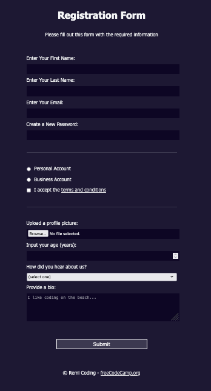

# registration-form-page

This repository contains the HTML and CSS for the **Learn HTML Forms by Building a Registration Form** course by [freeCodeCamp](https://www.freecodecamp.org/learn/2022/responsive-web-design/).

The `index.html` file contains HTML tags such as `<form>`, `<fieldset>`, `<label>`, `<input>`, and more to provide different ways in which information can be collected from people visiting the webpage. These tags help to control what types of data people can type in the form.

The `css/styles.css` file contains CSS tools for styling the page.

The page can be viewed here: [Registration Form](https://remicoding.github.io/registration-form-page/)

For your convenience, here is a screenshot of the page:

